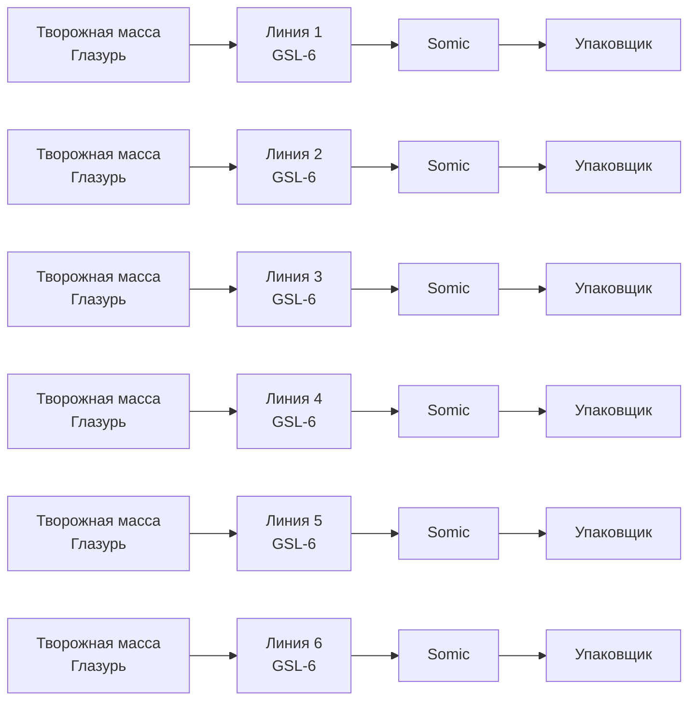

# Описание модели фасовки глазированных сырков

В цехе глазированных сырков шесть линий фасовки: три GSL-6 и три GLS-8.

## Производительность оборудования

|№ линии|Вид сырка|Производительность|
|---|---|---|
|1|Классика|200-208/мин; 7.2 тонн/сутки;|
||Плюш|200-208/мин; 8 тонн/сутки;|
|2|Классика|196/мин; 7.2 тонн/сутки;|
|3|Классика|206/мин; 7.2 тонн/сутки;|
||Корумс|170/мин; 5.2 тонн/сутки;|
|4|Классика|220/мин; 7.9 тонн/сутки;|
||Стержень|198/мин; 7.2 тонн/сутки;|
|5|Классика|220/мин; 7.9 тонн/сутки;|
||Стержень|198/мин; 7.2 тонн/сутки;|
||Корумс|170/мин; 5.2 тонн/сутки;|
|6|Классика|220/мин; 7.9 тонн/сутки;|
||Стержень|198/мин; 7.2 тонн/сутки;|

### Производительность somic-ов

+ на 1, 2, 3 линиях – 10-11 коробок/мин;
+ на 4, 5, 6 линиях – 13 коробок/мин; (начиная с марта 2025)

**В одной коробке 18 сырков.**

Производительность упаковщиков выше производительности somic-ов.

Один замес творожной массы на входе линии – 200 кг, поступает в бункер поточной линии в тележке.

### Мойка линий

+ Продолжительность –  4–5 часов
+ Необходимо выполнить мойку после аллергенов (сырков с орехами)
+ Без мойки можно выполнять переход от более светлого к более темному творогу (например: ваниль – бисквиты – шоколад), потом в конце обязательно выполнить мойку

## Варка глазури

|№  мельницы|Продолжительность варки|Вес в тоннах|
|---|---|---|
|1|7 часов|1|
|2|3 часа|2,5|
|3|3 часа|2,5|

**Итого 6 тонн в сутки.**

### 4 вида своей глазури, которую сами варят

|Код глазури|В каком продукте используется|
|---|---|
|C6|Топ, творобушки|
|С4|Ваниль, сгущенка, шоколад|
|С65(47)|Плюш, фисташка|
|Аленка|Аленка|

## Покупные глазури

+ Апельсин
+ Малина и другие

## Дополнительная информация

+ Часто чередуют определенные позиции ассортимента, например, один день – фисташка, второй – кокос-миндаль.
+ Объем производимых сырков: 39.7 – 42.1 тонн готового продукта в сутки.

## Актуальный ассортимент сырков

### Классическая линейка РБ

1. Сырок творожный глазированный «Савушкин» 23% ваниль, 40г
Конфетная линейка:
2. Сырок творожный глазированный «Любимая Коровка» 23%, 40г
3. Сырок творожный глазированный «Моя Алёнка» 20%, 40г
4. Сырок творожный глазированный «Кокос-миндаль» 20%, 40г
5. Сырок творожный глазированный «Бискотти» 20%, 40г
6. Сырок творожный глазированный «Картошка» 20%, 40г
7. Сырок творожный глазированный «Маковка» 20%, 40г
8. Сырок творожный глазированный «Кофе-карамель» 20%, 40г
ТОП. С начинкой:
9. Сырок творожный глазированный «ТОП» 20% с начинкой клубника, 40г
10. Сырок творожный глазированный «ТОП» 20% с начинкой манго, 40г
11. Сырок творожный глазированный «ТОП» 20% с начинкой вареная сгущёнка, 40г
12. Сырок творожный глазированный «ТОП» 20% какао с начинкой шоколад, 40г
13. Сырок творожный глазированный «ТОП» 20% с начинкой малина, 40г
14. Сырок творожный глазированный «ТОП» 20% с начинкой фундук, 40г
ТОП. С кусочками:
15. Сырок творожный глазированный «ТОП» 20% с кусочками карамельной глазури, 35г
16. Сырок творожный глазированный «ТОП» 20% с кусочками малиновой глазури, 35г
17. Сырок творожный глазированный «ТОП» 20% с кусочками апельсиновой глазури, 35г

### Классическая линейка РФ

1. Сырок творожный глазированный «Савушкин» 23% ваниль, 40г
2. Сырок творожный глазированный «Савушкин» 20% вареная сгущёнка, 40г
Конфетная линейка:
3. Сырок творожный глазированный «Любимая Коровка» 23%, 40г
4. Сырок творожный глазированный «Кокос-миндаль» 20%, 40г
5. Сырок творожный глазированный «Фисташка» 20%, 40г
ТВОРОБУШКИ. С начинкой:
6. Сырок творожный глазированный «Творобушки» 20% с начинкой клубника, 40г
7. Сырок творожный глазированный «Творобушки» 20% с начинкой манго, 40г
8. Сырок творожный глазированный «Творобушки» 20% с начинкой вареная сгущёнка, 40г
9. Сырок творожный глазированный «Творобушки» 20% какао с начинкой шоколад, 40г
ТВОРОБУШКИ. Классическая линейка:
10. Сырок творожный глазированный «Творобушки» 20% ваниль, 40г

## Модель данных и правила оптимизации для цеха глазированных сырков

+ Цель оптимизации
  + минимизировать смену глазури
  + минимизировать количество замены продукта по GTIN

На входе планировщика – разбивка производственного заказа по партиям.
На выходе – разбивка партий по линиям.

+ План работ

Для планирования производства был выбран инструмент `Timefold solver` с шаблоном `projectJobSheduling`. В нем применяется язык программирования `Java`, для сборки используется `Maven`. Так как разработчики шаблона использовали веб-решение на базе фреймворка `Quarkus`, необходимо было пересобрать проект как сервисное приложение, способное интегрироваться с брокером сообщений, добавить точку входа программы `ProjectJobScheduleApp.java`, удалить зависимости `Quarkus`, переписать тесты, файл сборки pom.xml, пересобрать все заново с помощью Maven, также были добавлены `Github Action` для автоматизации процесса тестирования и `CI/CD`. Эта задача была выполнена, а результаты были размещены в виде отдельного репозитория `PJS_Glase_cheeses` на `GitHub`.

[savushkin-r-d/PJS_Glase_cheeses](https://github.com/savushkin-r-d/PJS_Glase_cheeses)

Следующая задача - импорт модели оборудования, описания техпроцессов и производственного заказа с разбивкой по партиям из формата Json файла в объект класса ProjectJobSchedule, а также экспорт результата планирования в формат Json.

Следующий этап после завершения импорта/экспорта данных – настройка правил оптимизации для планирования расчета, а также разработка модульных тестов.

Последний этап – развертывание приложения: интеграция с веб-сервером, настройка брокера сообщений, настройка CI/CD, настройка визуализации. А также написание документации: руководства пользователя и руководства администратора.

+ Архитектура модулей программы

Поля корневого класса программы `ProjectJobSchedule` состоят из списков объектов следующих классов:

1. `Project` – партия
2. `Resource` – оборудование и материалы, также может быть персонал
3. `Job` – операции технологического процесса
4. `Allocation` – результат планирования, т. е. какая операция определенной партии на каком оборудовании в какое время будет выполняться.
5. `ExecutionMode` – вариант распределения выполнения технологической  операции по оборудованию, плюс время выполнения. Например, на одном оборудовании операция займет одно время, а на другом оборудовании - другое.
6. `ResourceRequirement` – требования к ресурсам, какие ресурсы нужны для выполнения операции по выбранному `ExecutionMode`.

+ Ограничения или правила оптимизации

В `Timefold Solver` ограничения могут быть классифицированы на три основных типа: `Hard`, `Medium` и `Soft`. Эти типы определяют важность ограничений и то, как они влияют на общую оценку решения.

Типы ограничений:

+ `Hard Constraints` (Жесткие ограничения):
  + Описание: Жесткие ограничения представляют собой обязательные правила, которые должны быть выполнены для любого допустимого решения. Если хотя бы одно жесткое ограничение нарушено, решение считается недопустимым.
  + **Пример:** В контексте планирования ресурсов, жесткое ограничение может быть связано с тем, что потребление ресурсов не должно превышать их доступную емкость. Или другой пример, когда две операции фасовки для разных партий не могут одновременно выполняться на одном оборудовании.

+ `Medium Constraints` (Средние ограничения):
  + Описание: Средние ограничения представляют собой правила, которые важны, но не обязательны для выполнения. Нарушение средних ограничений штрафуется, но решение остается допустимым.
  + **Пример:** В контексте планирования проектов, среднее ограничение может быть связано с задержкой в завершении проекта. Чем больше задержка, тем больше штраф, но проект все еще может быть завершен.
+ `Soft Constraints` (Мягкие ограничения):
  + Описание: Мягкие ограничения представляют собой правила, которые желательны, но не критичны. Нарушение мягких ограничений также штрафуется, но в меньшей степени, чем средние и жесткие.
  + Пример: В контексте планирования проектов, мягкое ограничение может быть связано с общей продолжительностью выполнения всех партий смены (makespan). Чем короче продолжительность, тем лучше, целочисленный показатель ограничения стремится к нулю, но никогда его не достигает.

**Ограничения описываются в файле** `ProjectJobSchedulingConstraintProvider.Java` в папке `solver`. Код в  данном файле представляет собой реализацию интерфейса `ConstraintProvider` из библиотеки `Timefold Solver` для `Java`.

**Основные компоненты и их назначение:**

+ Класс `ProjectJobSchedulingConstraintProvider`:
  + Этот класс реализует интерфейс `ConstraintProvider`, который требует переопределения метода `defineConstraints`.
  + Метод `defineConstraints` возвращает массив объектов `Constraint`, которые определяют правила (ограничения) для оптимизации.
+ Метод `defineConstraints`:
  + В этом методе определяются все ограничения, которые будут использоваться для оптимизации.
  + Каждое ограничение представлено отдельным методом, который возвращает объект `Constraint`.
  + Список существующих ограничений в шаблоне:
+ `nonRenewableResourceCapacity`:
  + Это `Hard` ограничение проверяет, что потребление невозобновляемых ресурсов (материалов) не превышает их доступную емкость.
  + Используется метод `filter` для выбора только невозобновляемых ресурсов, `join` для соединения с объектами `Allocation`, `groupBy` для группировки по ресурсам и суммирования потребностей, и penalize для наложения штрафа, если потребность превышает емкость.
+ `renewableResourceCapacity`:
  + Это `Hard` ограничение проверяет, что потребление возобновляемых ресурсов (оборудования) не превышает их доступную емкость.
  + Аналогично предыдущему, но учитывает даты использования ресурсов.
+ `totalProjectDelay`:
  + Это `Medium` ограничение штрафует за задержку в завершении проекта.
  + Используется метод `filter` для выбора только конечных задач (`JobType.SINK`) и `penalize` для наложения штрафа на задержку.
+ `totalMakespan`:
  + Это `Soft` ограничение штрафует за общую продолжительность всех проектов смены (`makespan`).
  + Используется метод `groupBy` для нахождения максимальной даты окончания и `penalize` для наложения штрафа на эту дату.

**Как это работает:**

+ `ConstraintFactory`:
  + Это фабрика, которая предоставляет методы для           создания потоков данных и применения операций к ним.
  + Она используется для создания и настройки ограничений.
  + `Joiners`, `ConstraintCollectors`, и другие методы:
  + Эти методы позволяют создавать сложные запросы к данным, группировать их, фильтровать и применять различные операции.
+ `Penalize и Reward`:
  + Эти методы используются для наложения штрафов или вознаграждений на основе выполнения ограничений.
  + `Penalize` увеличивает оценку, если ограничение нарушено, а Reward уменьшает оценку, если ограничение выполнено.

**Код ограничений можно редактировать, добавлять новые правила или удалять существующие.**

## Описание входных и выходных данных

+ Входные данные

Входные и выходные данные передаются в формате `JSON`.
Документ начинается со следующих полей:

### Таблица 1: Заголовок документа

|Поле|Тип|Описание|Пример значения|
|---|---|---|---|
|ID|String|Идентификатор расчета|P1570С30|
|StartDate|Date|Дата и время начала смены|2025-02-02 00:00:00|
|EndDate|Date|Дата и время конца смены|2025-02-03 00:00:00|
|Termination|String|Условие завершения расчета|TS180;US10|
|ResourceList|Resource[]|Массив структур Resource (оборудование, материалы, персонал)||
|JobList|Job[]|Массив структур Job (описание операций техпроцесса)||
|ProjectList|Project[]|Массив структур Project партий производственного заказа||

### Таблица 2: Ресурсы (Resource)

|Поле|Тип|Описание|Пример значения|
|---|---|---|---|
|RID|String|Уникальный идентификатор ресурса|51|
|Capacity|Number|Количество ресурса|9|
|Global|Y/N|Признак глобального ресурса (общего для всех партий)Yes|
|Renewable|Y/N|Признак возобновляемого ресурса (оборудование или персонал)|Yes|
|RestrictionList|Restriction[]|Массив структур Restriction недоступность ресурса (плановые аварийные остановки, производство партий предыдущей смены)||

### Таблица 3: Недоступность ресурса (RestrictionList)

|Поле|Тип|Описание|Пример значения|
|---|---|---|---|
|StartRestriction|Date|Дата и время начала периода|2025-02-02 13:00:00|
|EndRestriction|Date|Дата и время конца периода|2025-02-02 13:59:59|
|Quantity|Number|Количество ресурса|5|

### Таблица 4: Операция техпроцесса (Job)

|Поле|Тип|Описание|Пример значения|
|---|---|---|---|
|JID|String|Уникальный идентификатор операции|SOURCE, SINK или номер операции|
|SuccessorList|Successor[]|Массив структур Successor последующих операций за данной||

### Таблица 5: Следующая операция (Successor)

|Поле|Тип|Описание|Пример значения|
|---|---|---|---|
|Successor|String|Уникальный идентификатор операции|SINK или номер операции|

### Таблица 6: Проекты (Project) или партии

|Поле|Тип|Описание|Пример значения|
|---|---|---|---|
|PID|String|Уникальный идентификатор проекта (партии)|1190163|
|Priority|Number|Приоритет партии|0|
|VB|Number|Масса|227|
|GTIN|String[14]|Код товара|01234567890123|
|NP|Number|Номер партии|261|
|ExecutionModeList|ExecutionMode[]|Массив структур режимов выполенения||

### Таблица 7: Режимы выполнения (ExecutionMode)

|Поле|Тип|Описание|Пример значения|
|---|---|---|---|
|JID|String|Уникальный идентификатор операции|SOURCE, SINK или номер операции|
|Duration|Number|Время выполнения (мин)|47|
|ResourceRequirementList|ResourceRequirement[]|Массив структур ResourceRequirement требований к ресурсам||

### Таблица 8: Требования к ресурсам (ResourceRequirement)

|Поле|Тип|Описание|Пример значения|
|---|---|---|---|
|RID|String|Уникальный идентификатор ресурса|51|
|Requirement|Number|Количество ресурса|4|

+ Выходные данные

### Таблица 1 Заголовок документа

|Поле|Тип|Описание|Пример значения|
|---|---|---|---|
|ID|String|Идентификатор расчета|P1570С30|
|HardConstraintsPenalty|Number|Результат расчета по жестким ограничениям|0|
|MediumConstraintsPenalty1|Number|Результат расчета по средним ограничениям|-100|
|SoftConstraintsPenalty|Number|Результат расчета по мягким ограничениям|-767|
|AllocationList|Allocation[]|Массив структур Allocation (результат планирования каждой операции каждого проекта)||

### Таблица 2: Распределение планирования (Allocation)

|Поле|Тип|Описание|Пример значения|
|---|---|---|---|
|ID|String|Уникальный идентификатор распределения|Allocation-2|
|PID|String|Уникальный идентификатор проекта (партии)|1190163|
|JID|String|Уникальный идентификатор операции|903|
|StartDate|Date|Дата и время начала операции|2025-02-02 09:00:00|
|EndDate|Date|Дата и время конца операции|2025-02-02 09:36:00|
|Duration|Number|Длительность операции в минутах|36|
|ResourceRequirementList|ResourceRequirement[]|Массив структур ResourceRequirement потребленных ресурсов||
|PredAllocationList|PredAllocation[]|Массив структур PredAllocation (идентификатор распределения предыдущей операции техпроцесса)||

### Таблица 3: Предыдущее распределение (PredAllocation)

|Поле|Тип|Описание|Пример значения|
|---|---|---|---|
|PredAllocation|String|Идентификатор предыдущего распределения|Allocation-1|
